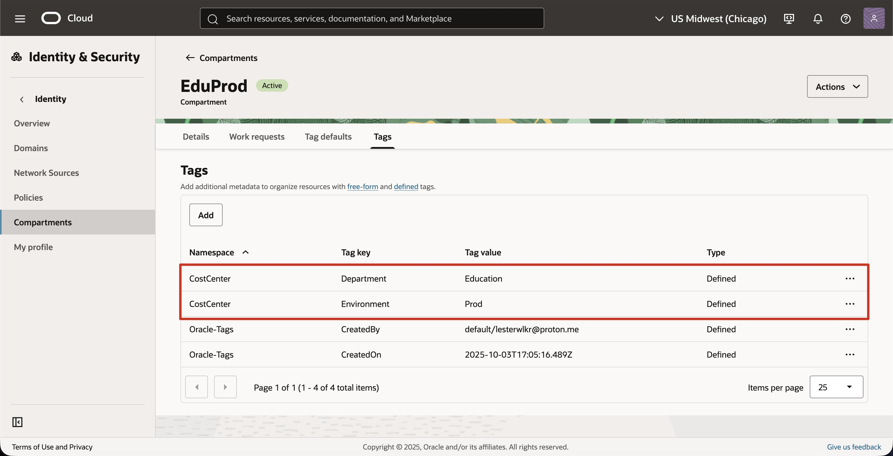
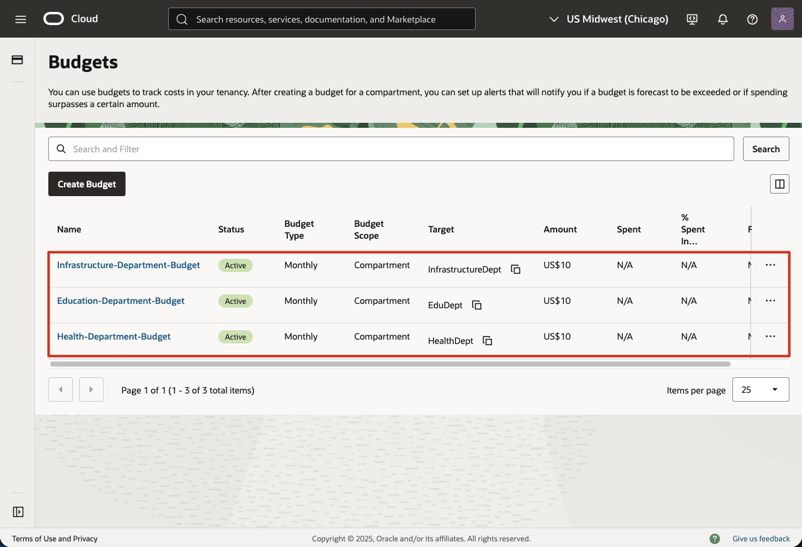

# Multi-Department IAM & Governance Project

[](https://www.oracle.com/cloud/)
[]()
[]()

> **OCI Architect Associate Certification Project**: Implementing enterprise-grade identity and access management with compartmental isolation, demonstrating real-world public sector cloud governance.

## 📋 Table of Contents
- [Project Overview](#-project-overview)
- [Architecture](#-architecture)
- [OCI Services Used](#️-oci-services-used)
- [Prerequisites](#-prerequisites)
- [Implementation Guide](#-implementation-guide)
- [Validation & Testing](#-validation--testing)
- [Cost Analysis](#-cost-analysis)
- [Security Considerations](#-security-considerations)
- [Key Learnings](#-key-learnings)
- [Troubleshooting](#-troubleshooting)
- [References](#-references)

---

## 🎯 Project Overview

### Objective
Design and implement a multi-tenant compartment structure with granular IAM policies, simulating a government organization with three independent departments: **Health**, **Education**, and **Infrastructure**. Each department operates with isolated resources, dedicated access controls, and independent budget tracking.

### GovTech Relevance
This architecture mirrors real-world government cloud deployments where:
- Departments require complete resource isolation
- Compliance mandates least-privilege access
- Budget accountability is critical for auditing
- Cross-department collaboration is controlled and logged

### What This Demonstrates
- Hierarchical compartment design
- Group-based access control (GBAC)
- Policy inheritance and scoping
- Dynamic groups for service-to-service authentication
- Tag-based cost allocation
- Budget monitoring and alerting
- Audit logging and compliance validation

---

## 🏗️ Architecture

### Compartment Hierarchy
```
Root Compartment (Tenancy)
│
└── GovTech-Parent
    │
    ├── Health-Dept
    │   ├── Health-Dev
    │   └── Health-Prod
    │
    ├── Education-Dept
    │   ├── Education-Dev
    │   └── Education-Prod
    │
    └── Infrastructure-Dept
        ├── Infrastructure-Dev
        └── Infrastructure-Prod
```

### Architecture Diagram


**Design Rationale:**
- **Parent Compartment**: Centralizes governance policies
- **Department Compartments**: Enforce organizational boundaries
- **Environment Sub-compartments**: Separate development and production workloads

### Resource Distribution
Each department contains:
- 🌐 **VCN** with public/private subnets
- 💻 **Compute Instance** (Oracle Linux)
- 🗄️ **Object Storage Bucket**
- 💾 **Block Volume**

---

## 🛠️ OCI Services Used

| Service | Purpose |
|---------|---------|
| **Compartments** | Logical isolation of resources |
| **IAM - Users & Groups** | Human identity management |
| **IAM - Dynamic Groups** | Service-to-service authentication |
| **IAM - Policies** | Fine-grained access control |
| **Tag Namespaces** | Metadata organization |
| **Tag Defaults** | Automatic resource tagging |
| **Budgets** | Cost monitoring and alerts |
| **Cost Analysis** | Tag-based spending reports |
| **Audit** | Access logging and compliance |
| **VCN** | Network isolation |
| **Compute** | Workload deployment |
| **Object Storage** | Data storage |
| **Block Volume** | Persistent storage |

---

## 📚 Prerequisites

### Required Access
- OCI Tenancy with administrator privileges
- OCI Free Tier account (sufficient for this project)

### Tools & Setup
```bash
# OCI CLI (optional but recommended)
brew install oci-cli  # macOS
# or
bash -c "$(curl -L https://raw.githubusercontent.com/oracle/oci-cli/master/scripts/install/install.sh)"

# Configure CLI
oci setup config

# Terraform (optional)
brew install terraform
```

### Knowledge Requirements
- Basic understanding of IAM concepts
- Familiarity with policy syntax
- OCI Console navigation

---

## 📋 Implementation Guide

### Phase 1: Compartment Setup

#### Step 1.1: Create Parent Compartment
```bash
# Using OCI Console
Identity & Security → Compartments → Create Compartment

Name: GovTech-Parent
Description: Parent compartment for all government departments
```

#### Step 1.2: Create Department Compartments
Create three compartments under `GovTech-Parent`:

| Name | Description | Parent |
|------|-------------|--------|
| Health-Dept | Health department resources | GovTech-Parent |
| Education-Dept | Education department resources | GovTech-Parent |
| Infrastructure-Dept | Infrastructure department resources | GovTech-Parent |

#### Step 1.3: Create Environment Sub-compartments
For **each** department, create:
- `{Department}-Dev` - Development environment
- `{Department}-Prod` - Production environment


---

### Phase 2: IAM Groups & Users

#### Step 2.1: Create IAM Groups
Navigate to: `Identity & Security → Groups`

Create the following groups:

**Department-Specific Groups:**
- `HealthAdmins` - Full control over Health compartment
- `HealthDevelopers` - Limited to Health-Dev environment
- `HealthViewers` - Read-only access to Health resources
- `EducationAdmins`
- `EducationDevelopers`
- `EducationViewers`
- `InfrastructureAdmins`
- `InfrastructureDevelopers`
- `InfrastructureViewers`

**Cross-Department Groups:**
- `BudgetAnalysts` - View costs across all departments
- `SecurityAuditors` - Read-only access for compliance

#### Step 2.2: Create Test Users
Create at least 2 test users per group:

```
# Example naming convention
health-admin-1@example.com
health-dev-1@example.com
health-viewer-1@example.com
edu-admin-1@example.com
...
```

#### Step 2.3: Add Users to Groups
Assign each test user to their respective group. Example screenshot below for HealthAdmin users being added:


---

### Phase 3: IAM Policies

#### Step 3.1: Department Admin Policies
**Policy Name**: `Health-Admins-Policy`  
**Compartment**: Applied at `Health-Dept` level

```
Allow group HealthAdmins to manage all-resources in compartment Health-Dept
```


Repeat for Education and Infrastructure departments.


#### Step 3.2: Developer Policies
**Policy Name**: `Health-Developers-Policy`  
**Compartment**: Applied at `HealthDept` level

```
Allow group HealthDevelopers to manage instance-family in compartment HealthDept
Allow group HealthDevelopers to use virtual-network-family in compartment HealthDept
Allow group HealthDevelopers to manage volume-family in compartment HealthDept
Allow group HealthDevelopers to manage object-family in compartment HealthDept
Allow group HealthDevelopers to inspect all-resources in compartment HealthDept
```


**Key Points:**
- Developers can **manage** resources in Dev
- Developers can only **inspect** (read-only) in Prod
- Uses resource families for granular control

#### Step 3.3: Viewer Policies
**Policy Name**: `Health-Viewers-Policy`

```
Allow group HealthViewers to inspect all-resources in compartment Health-Dept
Allow group HealthViewers to read all-resources in compartment Health-Dept
```


#### Step 3.4: Cross-Department Policies
**Policy Name**: `Budget-Analysts-Policy`  
**Compartment**: Applied at `GovTech-Parent` level

```
Allow group BudgetAnalysts to read usage-reports in compartment GovTech-Parent
Allow group BudgetAnalysts to inspect compartments in compartment GovTech-Parent
Allow group BudgetAnalysts to read usage-budgets in compartment GovTech-Parent
```


**Policy Name**: `Security-Auditors-Policy`  
**Compartment**: Applied at `GovTech-Parent` level

```
Allow group SecurityAuditors to inspect all-resources in compartment GovTech-Parent
Allow group SecurityAuditors to read audit-events in compartment GovTech-Parent
Allow group SecurityAuditors to read policies in tenancy
```


#### Step 3.5: Dynamic Groups
**Dynamic Group Name**: `Health-Compute-Instances`

**Matching Rule**:
```
All {instance.compartment.id = '<Health-Dept-OCID>'}
```


**Policy for Dynamic Group**:
```
Allow dynamic-group Health-Compute-Instances to read objects in compartment Health-Dept
Allow dynamic-group Health-Compute-Instances to manage object-family in compartment Health-Dept where target.bucket.name='health-app-data'
```

Repeat for other departments.

**All Policies Location**: `./policies/` directory

---

### Phase 4: Tagging Strategy

#### Step 4.1: Create Tag Namespace
Navigate to: `Identity & Security → Tags`

**Namespace Name**: `CostCenter`  
**Description**: Cost allocation and tracking tags

#### Step 4.2: Create Tag Keys
Create the following tags within `CostCenter` namespace:

| Tag Key | Description | Valid Values |
|---------|-------------|--------------|
| `Department` | Owning department | Health, Education, Infrastructure |
| `Environment` | Deployment environment | Dev, Prod |
| `Project` | Project identifier | Unassigned |
| `Owner` | Resource owner email | Unassigned |

#### Step 4.3: Set Tag Defaults
Configure automatic tagging for each compartment:

**Health-Dev Compartment**:
- `CostCenter.Department` = Health
- `CostCenter.Environment` = Dev

**Health-Prod Compartment**:
- `CostCenter.Department` = Health
- `CostCenter.Environment` = Prod

Repeat for all compartments.





---

### Phase 5: Deploy Sample Resources

#### Deploy for Health Department

**5.1: Create VCN**

**NOTE** An attempt was made to launch a sample resource in the Health compartment using the VM.Standard.A1.Flex shape. Due to persistent "Out of Capacity" errors, the resource deployment could not be completed at this time. This portion of the project will be updated when resources become available. If the instance had launched, we'd login as an user from the HealthAdmins group and attempt to view resources in the EducationDept compartment. The result would be a successful "Authorization Failed" message, proving that the policies written in this step are functioning correctly. 

---

### Phase 6: Budget & Cost Tracking


Navigate to: `Billing & Cost Management → Budgets`

**Budget Configuration (Health Department)**:
```
Name: Health-Department-Budget
Compartment: Health-Dept
Target: $10.00 USD monthly
Alert Rule: 80% of budget
Alert Recipients: health-admin-1@example.com
```

Create similar budgets for Education ($10) and Infrastructure ($10).


---

## Validation & Testing

### Test Scenario 1: Positive Access Control
**Objective**: Verify admins can manage resources in their compartment

**Steps**:
1. Log in as `health-admin-1@example.com`
2. Navigate to Health-Dev compartment
3. Create a test compute instance
4. Verify instance creation succeeds
5. Delete the test instance

**Expected Result**: All operations succeed

**Screenshot Location**: `./validation/01-positive-admin-access.png`

---

### Test Scenario 2: Developer Environment Restrictions
**Objective**: Verify developers can only manage Dev, not Prod

**Steps**:
1. Log in as `health-dev-1@example.com`
2. Navigate to Health-Dev compartment
3. Create a test compute instance
4. Navigate to Health-Prod compartment
5. Attempt to create a compute instance

**Expected Result**: 
- Dev instance creation succeeds
- Prod instance creation fails with "Authorization failed"

**Screenshot Location**: `./validation/02-developer-restrictions.png`

---

### Test Scenario 3: Cross-Department Isolation
**Objective**: Verify department isolation

**Steps**:
1. Log in as `health-admin-1@example.com`
2. Attempt to view Education-Dept compartment
3. Attempt to create resources in Education-Dept

**Expected Result**: Both actions fail with authorization error

**Screenshot Location**: `./validation/03-cross-department-isolation.png`

---

##  Security Considerations

### Implemented Security Best Practices

1. **Least Privilege Access**
   - Users only have permissions necessary for their role
   - Developers cannot access production
   - Viewers have read-only access

2. **Compartment Isolation**
   - Complete resource separation between departments
   - Policy inheritance prevents privilege escalation

3. **Audit Logging**
   - All actions logged and retained
   - Failed access attempts tracked for security monitoring

4. **Service Authentication**
   - Dynamic groups used instead of API keys
   - Instance principals for secure service-to-service communication

5. **Network Isolation**
   - Each department has separate VCN
   - Private subnets for sensitive workloads
   - Security lists restrict traffic

### Potential Enhancements
- [ ] Implement MFA requirement for admin groups
- [ ] Add policy conditions for IP-based restrictions
- [ ] Enable Cloud Guard for threat detection
- [ ] Implement federation with identity provider
- [ ] Add DDoS protection policies


---

## 🔧 Troubleshooting

### Common Issues

**Issue 1: "Authorization failed" when creating resources**
- **Cause**: Policy not applied or incorrect compartment selected
- **Solution**: Verify policy syntax, wait 30 seconds for propagation, check user's group membership

**Issue 2: Dynamic group not working**
- **Cause**: Matching rule incorrect or policy missing
- **Solution**: Verify instance compartment OCID, ensure instance has been restarted after dynamic group creation

**Issue 3: Tags not appearing on resources**
- **Cause**: Tag defaults not applied or resource created before tag default
- **Solution**: Manually apply tags, or recreate resource after tag default setup

**Issue 4: Budget alerts not received**
- **Cause**: Email not verified or budget threshold not crossed
- **Solution**: Check spam folder, verify email in notifications, lower budget threshold for testing

**Issue 5: Cannot view cost reports**
- **Cause**: Insufficient permissions
- **Solution**: Ensure user has `read usage-reports` permission at appropriate compartment level

---

## 📚 References

### Official OCI Documentation
- [Compartments Overview](https://docs.oracle.com/en-us/iaas/Content/Identity/Tasks/managingcompartments.htm)
- [IAM Policy Reference](https://docs.oracle.com/en-us/iaas/Content/Identity/Reference/policyreference.htm)
- [Dynamic Groups](https://docs.oracle.com/en-us/iaas/Content/Identity/Tasks/managingdynamicgroups.htm)
- [Tagging Resources](https://docs.oracle.com/en-us/iaas/Content/Tagging/Concepts/taggingoverview.htm)
- [Cost Management](https://docs.oracle.com/en-us/iaas/Content/Billing/Concepts/billingoverview.htm)

### Learning Resources
- [OCI Architect Associate Certification](https://education.oracle.com/oracle-cloud-infrastructure-2024-architect-associate/pexam_1Z0-1072-24)
- [OCI Free Tier](https://www.oracle.com/cloud/free/)
- [OCI CLI Documentation](https://docs.oracle.com/en-us/iaas/Content/API/Concepts/cliconcepts.htm)


---

## 📄 License

This project is licensed under the MIT License - see the [LICENSE](LICENSE) file for details.

---

**Note**: This is a demonstration project for certification preparation. Always follow your organization's security policies and compliance requirements in production environments.

